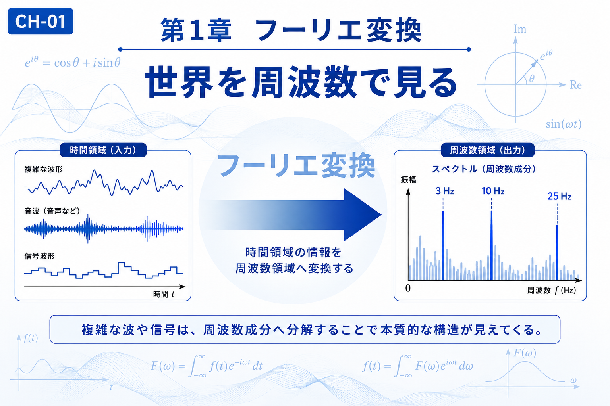

# Chapter 1 — Fourier Transform

# 第1章　フーリエ変換

← [Back to Part I / 第1部へ戻る](pt-01.md)

← [Back to Articles / 記事一覧へ戻る](README.md)

---

# English

## Overview

Fourier Transform provides a new way of looking at signals and waves.

Instead of observing only how a signal changes over time, it decomposes the signal into its frequency components. This change of perspective often reveals patterns that are difficult to recognize in the original waveform.

Because of its broad applicability, the Fourier Transform has become one of the fundamental tools in mathematics, engineering, and physics. It also serves as the starting point for many of the concepts introduced later in this textbook.

## What You Will Learn

In this chapter, you will learn:

* Why frequency is an important viewpoint.
* How complex signals can be represented by simple frequency components.
* The relationship between time-domain and frequency-domain representations.
* Why Fourier Transform forms the foundation of later transformations.

## Related Figures

* CH-01 — Chapter Header
* SS-01 — Fourier Transform
* S-01 — What Is a Wave?
* S-02 — Complex Plane
* S-03 — Fourier Series
* S-04 — Frequency Domain

---

# 日本語

## 概要

フーリエ変換は、波や信号を**周波数という新しい視点**から理解するための基本的な変換です。

時間変化として観測していた複雑な波形も、周波数成分へ分解することで、その構造や特徴をより明確に捉えられるようになります。

フーリエ変換は数学だけでなく、信号処理、画像処理、音響、通信、物理学など幅広い分野で利用されており、本教材全体の出発点となる重要な概念です。

## この章で学ぶこと

本章では、

* 周波数という考え方
* 複雑な波を周波数成分へ分解する意味
* 時間領域と周波数領域の関係
* 後続の変換へどのようにつながるか

を理解することを目標とします。

## 関連図

* CH-01　章タイトル図
* SS-01　フーリエ変換
* S-01　波とは何か
* S-02　複素平面
* S-03　フーリエ級数
* S-04　周波数空間

---

## Navigation

Next →

[CH-02 Convolution / 第2章 畳み込み](ch-02.md)

← [Back to Part I / 第1部へ戻る](pt-01.md)

← [Back to Articles / 記事一覧へ戻る](README.md)
