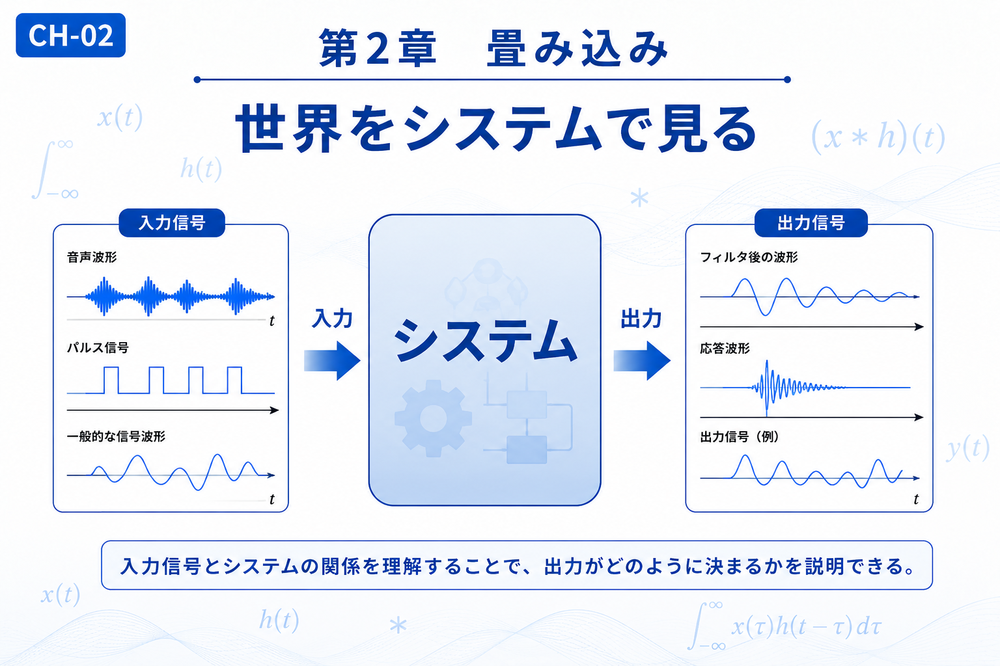

# Chapter 2 — Convolution

# 第2章　畳み込み

← [Back to Part I / 第1部へ戻る](pt-01.md)

← [Back to Articles / 記事一覧へ戻る](README.md)

---

# English

## Overview

After learning how the Fourier Transform changes our perspective, the next question is how a system responds to an input.

Convolution provides a mathematical framework for describing this relationship. Rather than focusing on signals alone, it explains how an input signal interacts with a system to produce an output.

This idea appears throughout science and engineering, including signal processing, control systems, optics, communications, and image processing. Understanding convolution also prepares readers for the Fast Fourier Transform (FFT), where convolution and multiplication become closely connected.

## What You Will Learn

In this chapter, you will learn:

* The relationship between input, system, and output.
* Why convolution is a universal description of linear systems.
* The connection between convolution and the Fourier Transform.
* How this concept leads naturally to the FFT.

## Related Figures

* CH-02 — Chapter Header
* SS-02 — Convolution
* S-04 — Input and Output
* S-05 — Impulse Response
* S-06 — Convolution Process

---

# 日本語

## 概要

フーリエ変換が「**見方を変える**」ための変換であったのに対し、畳み込みは「**システムが入力にどのように応答するか**」を表現するための基本概念です。

入力信号とシステムの性質が分かれば、どのような出力が得られるのかを数学的に説明できます。この考え方は、信号処理だけでなく、制御工学、通信、画像処理、光学など幅広い分野で利用されています。

また、畳み込みはフーリエ変換と密接に関係しており、後に学ぶFFTを理解するための重要な基礎となります。

## この章で学ぶこと

本章では、

* 入力・システム・出力の関係
* 畳み込みが線形システムを記述する理由
* フーリエ変換との関係
* FFTへどのようにつながるか

を理解することを目標とします。

## 関連図

* CH-02　章タイトル図
* SS-02　畳み込み
* S-04　入力と出力
* S-05　インパルス応答
* S-06　畳み込みの仕組み

---

## Navigation

Previous →

[CH-01 Fourier Transform / 第1章 フーリエ変換](ch-01.md)

Next →

[CH-03 FFT / 第3章 FFT](ch-03.md)

← [Back to Part I / 第1部へ戻る](pt-01.md)

← [Back to Articles / 記事一覧へ戻る](README.md)
