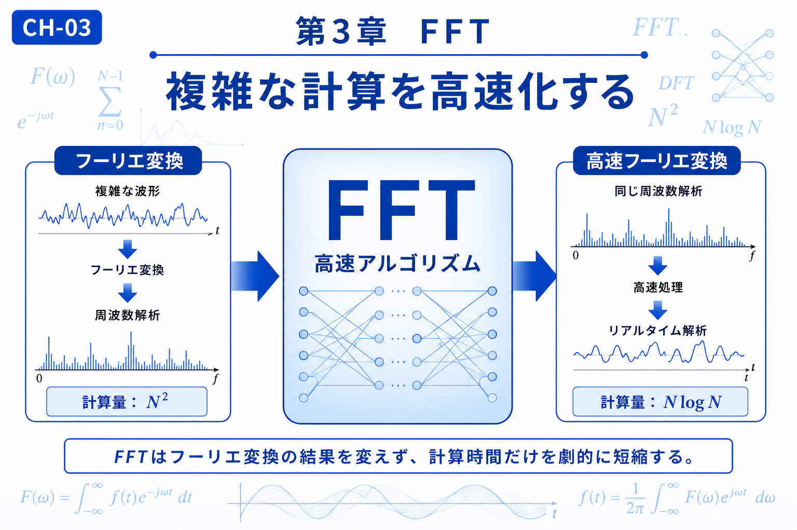

# Chapter 3 — Fast Fourier Transform (FFT)

# 第3章　FFT

← [Back to Part I / 第1部へ戻る](pt-01.md)

← [Back to Articles / 記事一覧へ戻る](README.md)

---

# English

## Overview

The Fast Fourier Transform (FFT) is not a new mathematical transform.

Instead, it is an efficient algorithm for computing the Discrete Fourier Transform (DFT). By reorganizing the calculation, FFT dramatically reduces the computational cost while producing exactly the same result.

This breakthrough made real-time signal processing practical and has become one of the most influential algorithms in modern science and engineering.

Building on the Fourier Transform introduced in the previous chapters, FFT demonstrates how mathematical insight can transform an impractical computation into an efficient one.

## What You Will Learn

In this chapter, you will learn:

* The relationship between DFT and FFT.
* Why FFT is significantly faster than direct computation.
* How computational efficiency enables real-time applications.
* Why FFT became a milestone in digital signal processing.

## Related Figures

* CH-03 — Chapter Header
* [S-08 — FFT Revolution (N² → N log N)](../figures/s/s-08.png)
* [S-09 — Butterfly Algorithm](../figures/s/s-09.png)
* [S-10 — GPU FFT](../figures/s/s-10.png)

---

# 日本語

## 概要

FFT（高速フーリエ変換）は、新しい変換ではありません。

FFTとは、**離散フーリエ変換（DFT）を効率よく計算するためのアルゴリズム**です。同じ計算結果を保ったまま計算手順を工夫することで、計算量を大幅に削減し、高速な周波数解析を可能にしました。

この高速化により、音声処理、画像処理、通信、計測など、リアルタイム性が求められる多くの分野でフーリエ変換が実用化されました。

本章では、フーリエ変換の考え方を受け継ぎながら、「理論を実際に活用するための計算技術」という視点からFFTを理解します。

## この章で学ぶこと

本章では、

* DFTとFFTの関係
* FFTが高速である理由
* 計算量とアルゴリズムの考え方
* FFTが現代の信号処理で果たす役割

を理解することを目標とします。

## 関連図

* CH-03　章タイトル図
* [S-08　FFT革命（N²→N log N）](../figures/s/s-08.png)
* [S-09　バタフライ演算](../figures/s/s-09.png)
* [S-10　GPU FFT](../figures/s/s-10.png)

---

## Navigation

Previous →

[CH-02 Convolution / 第2章 畳み込み](ch-02.md)

Next →

[CH-04 Wavelet Transform / 第4章 ウェーブレット変換](ch-04.md)

← [Back to Part I / 第1部へ戻る](pt-01.md)

← [Back to Articles / 記事一覧へ戻る](README.md)
