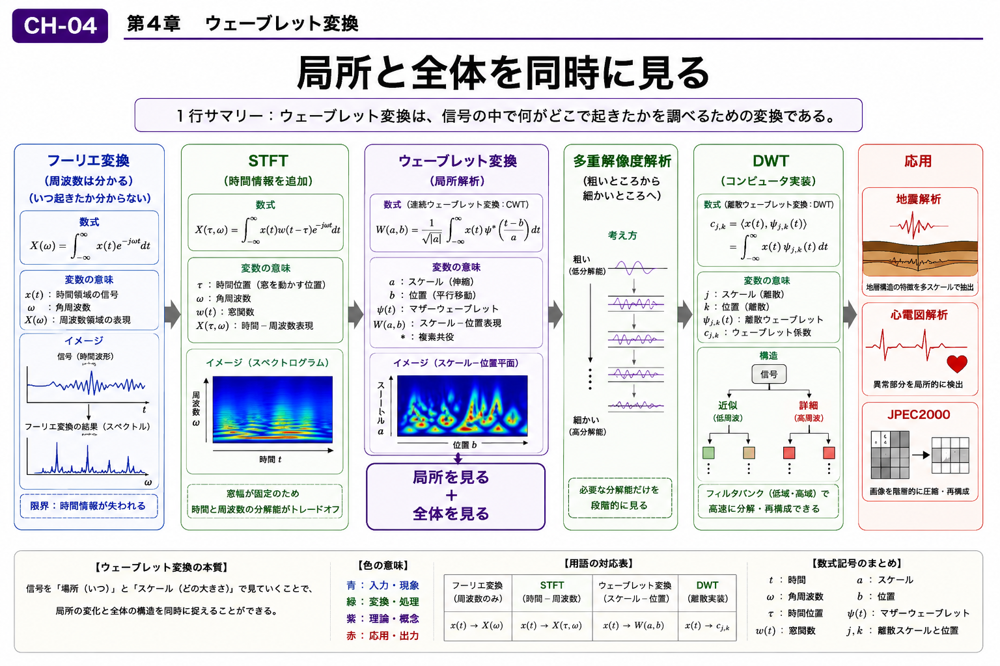

# Chapter 4 — Wavelet Transform

# 第4章　ウェーブレット変換

← [Back to Part I / 第1部へ戻る](pt-01.md)

← [Back to Articles / 記事一覧へ戻る](README.md)

---

# English

## Overview

The Fourier Transform provides a powerful way to analyze frequency, but it assumes that the frequency content remains unchanged over time.

Many real-world signals, however, are transient. Their characteristics evolve over time, making it important to analyze both **when** and **which** frequencies appear.

Wavelet Transform addresses this limitation by combining time and frequency information into a single framework. Rather than replacing the Fourier Transform, it complements it by providing a multi-resolution view of signals.

This chapter introduces the basic idea of Wavelet Transform and explains why it has become an important tool in signal analysis, image processing, and data compression.

## What You Will Learn

In this chapter, you will learn:

* Why Fourier analysis alone is sometimes insufficient.
* How Wavelet Transform combines time and frequency information.
* The concept of multi-resolution analysis.
* Applications of Wavelet Transform in science and engineering.

## Related Figures

* CH-04 — Chapter Header
* SS-04 — Wavelet Transform
* S-10 — Time–Frequency Representation
* S-11 — Multi-resolution Analysis
* S-12 — Wavelet Decomposition

---

# 日本語

## 概要

フーリエ変換は周波数解析に優れた手法ですが、「**いつ**その周波数が現れたのか」という時間的な情報を十分に表現することは得意ではありません。

実際の音声や地震波、生体信号など、多くの現象は時間とともに変化します。そのような信号を解析するために考案されたのが**ウェーブレット変換**です。

ウェーブレット変換は、時間と周波数の両方を考慮しながら信号を解析できる手法であり、フーリエ変換を置き換えるものではなく、その適用範囲を広げる重要な考え方です。

本章では、ウェーブレット変換の基本概念と、多重解像度解析という特徴的な考え方を学びます。

## この章で学ぶこと

本章では、

* フーリエ変換だけでは難しい解析
* 時間情報と周波数情報を同時に扱う考え方
* 多重解像度解析
* ウェーブレット変換の代表的な応用

を理解することを目標とします。

## 関連図

* CH-04　章タイトル図
* SS-04　ウェーブレット変換
* S-10　時間―周波数表現
* S-11　多重解像度解析
* S-12　ウェーブレット分解

---

## Navigation

Previous →

[CH-03 FFT / 第3章 FFT](ch-03.md)

Next →

[CH-05 Laplace Transform / 第5章 ラプラス変換](ch-05.md)

← [Back to Part I / 第1部へ戻る](pt-01.md)

← [Back to Articles / 記事一覧へ戻る](README.md)
