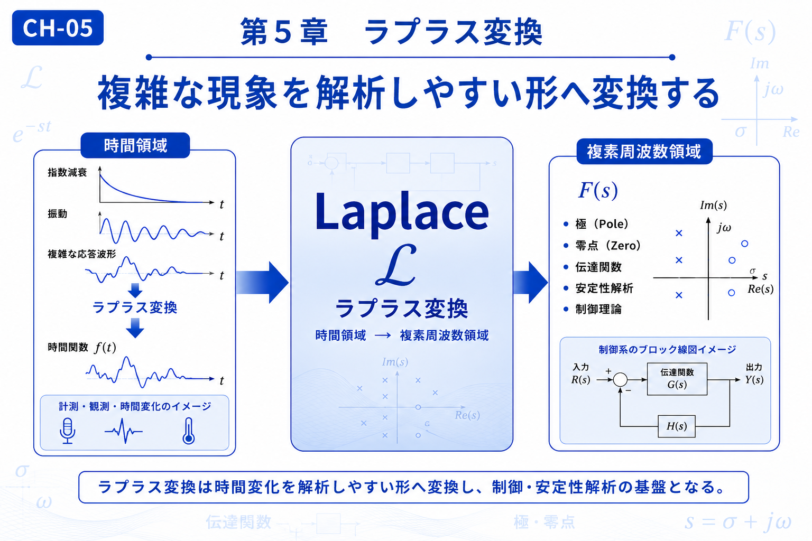

# Chapter 5 — Laplace Transform

# 第5章　ラプラス変換

← [Back to Part I / 第1部へ戻る](pt-01.md)

← [Back to Articles / 記事一覧へ戻る](README.md)

---

# English

## Overview

The transformations introduced so far have focused on analyzing signals and extracting their hidden structures. The Laplace Transform extends this idea by converting time-dependent phenomena into a mathematical form that is often much easier to analyze.

Unlike the Fourier Transform, which emphasizes frequency, the Laplace Transform also describes growth, decay, and system stability. This makes it one of the fundamental tools in control theory, circuit analysis, and differential equations.

As the final chapter of Part I, it also serves as a bridge to Part II, where the mathematical techniques introduced here are applied to the physical behavior of waves.

## What You Will Learn

In this chapter, you will learn:

* Why time-domain problems are transformed into the complex frequency domain.
* The concept of the complex variable *s*.
* How Laplace Transform simplifies system analysis.
* How these ideas connect to wave equations and electromagnetism.

## Related Figures

* CH-05 — Chapter Header
* [S-15 — Exponential Decay](../figures/s/s-15.png)
* [S-16 — Transfer Function](../figures/s/s-16.png)
* [S-17 — Stability Analysis](../figures/s/s-17.png)

---

# 日本語

## 概要

これまで学んできた変換は、波や信号を別の視点から理解するための手法でした。

ラプラス変換は、その考え方をさらに発展させ、**時間とともに変化する現象を解析しやすい数学空間へ写像する**ための変換です。

周波数だけでなく、指数的な増減やシステムの安定性まで扱えるため、制御工学、電気回路、微分方程式など幅広い分野で利用されています。

また、第1部の最後を飾る章として、本章で身につける「解析しやすい形へ変換する」という考え方は、第2部「波の世界」で学ぶ波動方程式やマクスウェル方程式へと自然につながっていきます。

## この章で学ぶこと

本章では、

* 時間領域から複素周波数領域へ変換する意味
* 複素変数 *s* の基本的な考え方
* ラプラス変換による解析の利点
* 波動方程式や電磁気学とのつながり

を理解することを目標とします。

## 関連図

* CH-05　章タイトル図
* [S-15　指数減衰](../figures/s/s-15.png)
* [S-16　伝達関数](../figures/s/s-16.png)
* [S-17　安定性解析](../figures/s/s-17.png)

---

## Navigation

Previous →

[CH-04 Wavelet Transform / 第4章 ウェーブレット変換](ch-04.md)

Next →

[CH-06 Wave Equation / 第6章 波動方程式](ch-06.md)

← [Back to Part I / 第1部へ戻る](pt-01.md)

← [Back to Articles / 記事一覧へ戻る](README.md)
