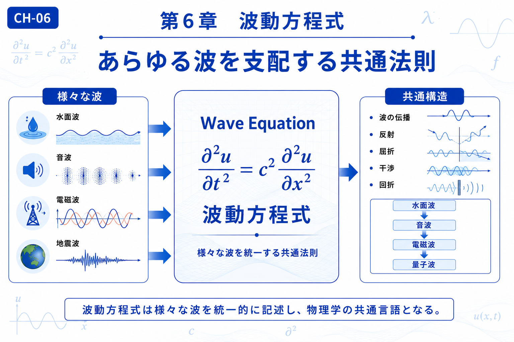

# Chapter 6 — Wave Equation

# 第6章　波動方程式

← [Back to Part II / 第2部へ戻る](pt-02.md)

← [Back to Articles / 記事一覧へ戻る](README.md)

---

# English

## Overview

In Part I, we learned how mathematical transformations reveal different perspectives on physical phenomena.

This chapter begins the study of the phenomena themselves.

Although water waves, sound waves, seismic waves, and electromagnetic waves appear very different, they all share a common mathematical description. The wave equation provides a unified framework for understanding how waves propagate through space and time.

Rather than studying each type of wave independently, this chapter introduces the wave equation as the common language that connects them. This idea becomes the foundation for electromagnetism in the next chapter and later for quantum mechanics.

## What You Will Learn

In this chapter, you will learn:

* Why many different waves follow the same mathematical law.
* The physical meaning of the wave equation.
* Common properties of wave propagation.
* How the wave equation connects to Maxwell's equations and quantum mechanics.

## Related Figures

* CH-06 — Chapter Header
* [SS-03 — Wave Equation](../figures/ss/ss-03.png)
* [S-18 — Unified View of Waves](../figures/s/s-18.png)

---

# 日本語

## 概要

第1部では、現象をさまざまな視点から理解するための**変換**について学びました。

本章からは、その考え方を自然界へ適用し、**波そのもの**を理解していきます。

水面波、音波、地震波、電磁波は、それぞれ異なる現象として観測されます。しかし、それらは共通する数学的構造を持ち、**波動方程式**によって統一的に記述できます。

本章では、波動方程式を「様々な波を結び付ける共通言語」として捉え、波の伝播や反射、干渉などの基本的な性質を学びます。この考え方は、次章のマクスウェル方程式、さらに第3部の量子力学へと発展していきます。

## この章で学ぶこと

本章では、

* 様々な波に共通する数学的構造
* 波動方程式の物理的な意味
* 波の伝播・反射・干渉などの基本現象
* マクスウェル方程式や量子力学とのつながり

を理解することを目標とします。

## 関連図

* CH-06　章タイトル図
* [SS-03　波動方程式](../figures/ss/ss-03.png)
* [S-18　波の統一](../figures/s/s-18.png)

---

## Navigation

Previous →

[CH-05 Laplace Transform / 第5章 ラプラス変換](ch-05.md)

Next →

[CH-07 Maxwell's Equations / 第7章 マクスウェル方程式](ch-07.md)

← [Back to Part II / 第2部へ戻る](pt-02.md)

← [Back to Articles / 記事一覧へ戻る](README.md)
