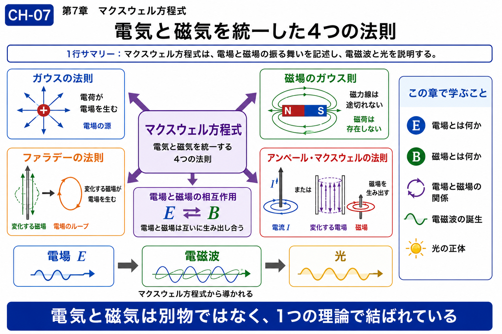

# Chapter 7 — Maxwell's Equations

# 第7章　マクスウェル方程式

← [Back to Part II / 第2部へ戻る](pt-02.md)

← [Back to Articles / 記事一覧へ戻る](README.md)

---

# English

## Overview

The wave equation provides a common mathematical description of wave propagation. Maxwell's equations reveal one of its most remarkable physical realizations: electromagnetic waves.

By unifying electricity and magnetism into a single theoretical framework, Maxwell demonstrated that light itself is an electromagnetic wave. This discovery established one of the greatest unifications in physics and became the foundation of modern electromagnetism.

Within this textbook, Maxwell's equations represent more than a set of physical laws. They illustrate how mathematical structures can explain diverse natural phenomena through a unified perspective, preparing the reader for the quantum description introduced in Part III.

## What You Will Learn

In this chapter, you will learn:

* How Maxwell's equations describe electromagnetic fields.
* Why light is understood as an electromagnetic wave.
* The relationship between Maxwell's equations and the wave equation.
* How classical wave theory leads naturally to quantum physics.

## Related Figures

* CH-07 — Chapter Header
* SS-04 — Electromagnetic Waves
* S-19 — Maxwell's Correction
* S-20 — Nature of Light

---

# 日本語

## 概要

波動方程式によって様々な波が共通の数理構造を持つことを学びました。

マクスウェル方程式は、その考え方を電磁気学へ適用した代表例であり、**光が電磁波であること**を示した歴史的にも重要な理論です。

電場と磁場を一つの理論として統一したことで、電磁気学は個別の現象の集まりではなく、共通する法則によって記述できる体系となりました。

本教材では、マクスウェル方程式を単なる電磁気学の法則としてではなく、「自然界を統一的に理解する考え方」の代表例として位置付けます。この視点は、第3部で扱う量子力学へと自然につながっていきます。

## この章で学ぶこと

本章では、

* マクスウェル方程式の基本的な役割
* 電場・磁場・電磁波の関係
* 波動方程式とのつながり
* 古典物理学から量子力学への橋渡し

を理解することを目標とします。

## 関連図

* CH-07　章タイトル図
* SS-04　電磁波
* S-19　マクスウェルの補正
* S-20　光の正体

---

## Navigation

Previous →

[CH-06 Wave Equation / 第6章 波動方程式](ch-06.md)

Next →

[CH-08 Schrödinger Equation / 第8章 シュレーディンガー方程式](ch-08.md)

← [Back to Part II / 第2部へ戻る](pt-02.md)

← [Back to Articles / 記事一覧へ戻る](README.md)
