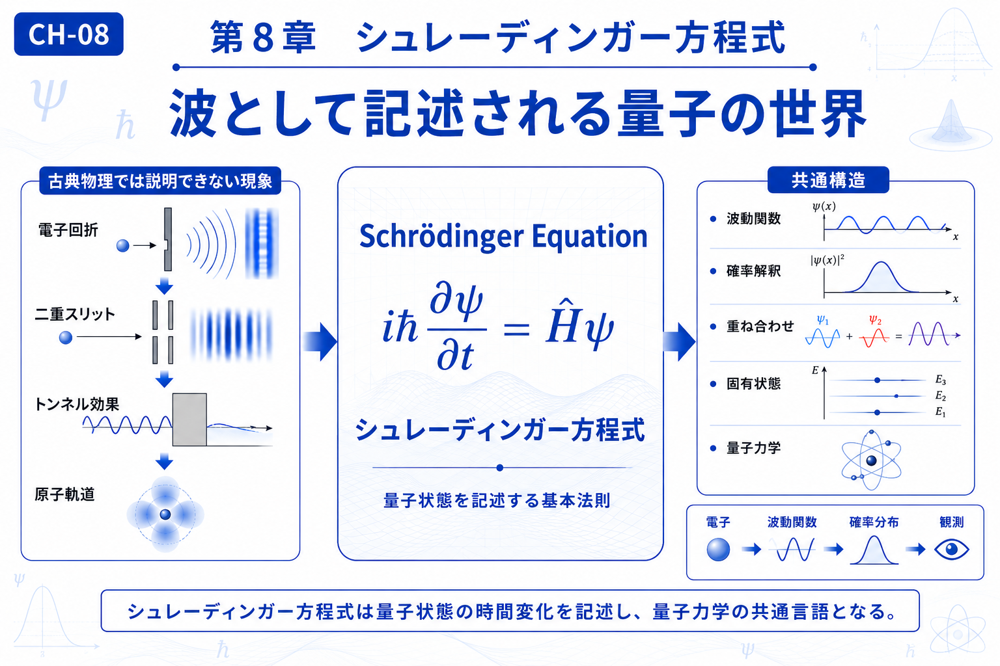

# Chapter 8 — Schrödinger Equation

# 第8章　シュレーディンガー方程式

← [Back to Part III / 第3部へ戻る](pt-03.md)

← [Back to Articles / 記事一覧へ戻る](README.md)

---

# English

## Overview

The Schrödinger equation marks the beginning of quantum mechanics in this textbook.

Rather than introducing an entirely new way of thinking, it extends the ideas developed in the previous chapters. Waves become wave functions, and the mathematical tools learned in Parts I and II continue to play an essential role in describing physical systems.

The Schrödinger equation explains how quantum states evolve over time and provides the foundation for understanding atoms, molecules, and many modern technologies.

In this chapter, quantum mechanics is presented not as an isolated theory, but as a natural continuation of the concepts of transformation and waves.

## What You Will Learn

In this chapter, you will learn:

* Why wave functions are used to describe quantum states.
* The role of the Schrödinger equation in quantum mechanics.
* The relationship between wave theory and quantum theory.
* How this chapter prepares for wave mechanics and matrix mechanics.

## Related Figures

* CH-08 — Chapter Header
* SS-08 — Schrödinger Equation
* S-22 — Wave Function
* S-23 — Probability Distribution
* S-24 — Quantum States

---

# 日本語

## 概要

シュレーディンガー方程式は、本教材における**量子力学の出発点**です。

しかし、本章で扱う考え方は、第1部・第2部と切り離された新しい理論ではありません。

これまで学んできた「変換」と「波」の考え方を土台として、波は**波動関数**へ、物理現象は**量子状態**へと発展していきます。

シュレーディンガー方程式は、量子状態が時間とともにどのように変化するかを記述する基本法則であり、原子や分子の振る舞いを理解するための基盤となります。

本章では、量子力学を独立した分野としてではなく、「変換」と「波」を受け継いだ自然な発展として学びます。

## この章で学ぶこと

本章では、

* 波動関数という考え方
* シュレーディンガー方程式の役割
* 波動方程式とのつながり
* 次章で扱う波動力学・行列力学への導入

を理解することを目標とします。

## 関連図

* CH-08　章タイトル図
* SS-08　シュレーディンガー方程式
* S-22　波動関数
* S-23　確率分布
* S-24　量子状態

---

## Navigation

Previous →

[CH-07 Maxwell's Equations / 第7章 マクスウェル方程式](ch-07.md)

Next →

[CH-09 Wave Mechanics = Matrix Mechanics / 第9章 波動力学＝行列力学](ch-09.md)

← [Back to Part III / 第3部へ戻る](pt-03.md)

← [Back to Articles / 記事一覧へ戻る](README.md)
