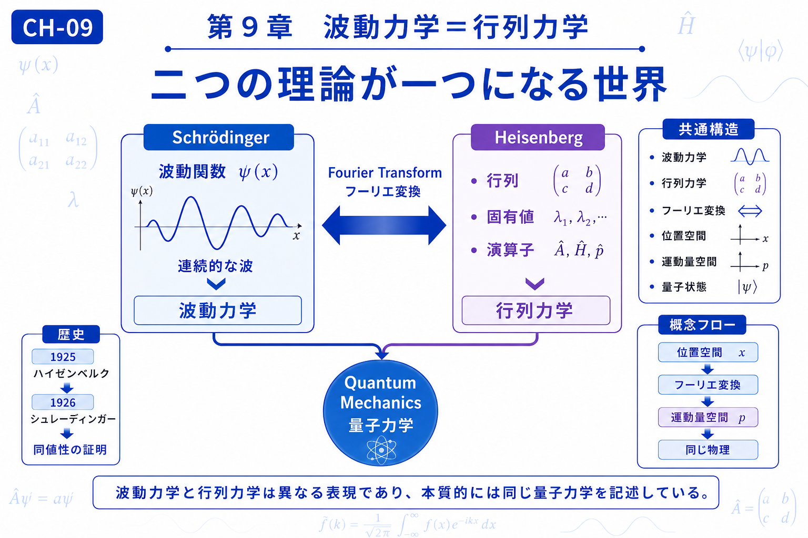

# Chapter 9 — Wave Mechanics = Matrix Mechanics

# 第9章　波動力学＝行列力学

← [Back to Part III / 第3部へ戻る](pt-03.md)

← [Back to Articles / 記事一覧へ戻る](README.md)

---

# English

## Overview

This chapter brings together many of the ideas introduced throughout the textbook.

Wave mechanics, developed by Schrödinger, and matrix mechanics, developed by Heisenberg, appear to describe quantum phenomena in very different mathematical ways. However, they are mathematically equivalent descriptions of the same physical reality.

The connection between these two formulations is closely related to the concept of transformation. By changing the mathematical representation—such as moving between position space and momentum space—we obtain different perspectives while describing the same quantum system.

This chapter demonstrates that different mathematical languages can reveal different aspects of a phenomenon without changing the underlying physics.

## What You Will Learn

In this chapter, you will learn:

* The relationship between wave mechanics and matrix mechanics.
* Why different mathematical representations can describe the same quantum system.
* The role of transformations in connecting these representations.
* How the concepts of transformation, waves, and quantum mechanics converge.

## Related Figures

* CH-09 — Chapter Header
* SS-09 — Wave Mechanics = Matrix Mechanics
* S-25 — Position Space and Momentum Space
* S-26 — Fourier Transform in Quantum Mechanics
* S-27 — Equivalent Representations

---

# 日本語

## 概要

本章では、本教材で学んできた多くの考え方が一つにつながります。

シュレーディンガーによる**波動力学**と、ハイゼンベルクによる**行列力学**は、一見すると全く異なる数学で記述されています。しかし、それらは**同じ量子力学を異なる表現で記述した理論**です。

この二つを結び付ける鍵となるのが、第1部から学んできた**変換**という考え方です。位置空間と運動量空間を行き来することで、同じ物理現象を異なる視点から表現できます。

本章では、「異なる数学的表現が同じ物理を記述できる」という量子力学の重要な考え方を理解し、本教材全体のテーマである「変換」の意味を改めて振り返ります。

## この章で学ぶこと

本章では、

* 波動力学と行列力学の関係
* 異なる表現が同じ量子状態を記述する理由
* 位置空間と運動量空間を結ぶ変換
* 「変換」「波」「量子」がどのように一つへまとまるか

を理解することを目標とします。

## 関連図

* CH-09　章タイトル図
* SS-09　波動力学＝行列力学
* S-25　位置空間と運動量空間
* S-26　量子力学におけるフーリエ変換
* S-27　同値な表現

---

## Navigation

Previous →

[CH-08 Schrödinger Equation / 第8章 シュレーディンガー方程式](ch-08.md)

Next →

[CH-10 Unified Physics / 終章 統一の物理学](ch-10.md)

← [Back to Part III / 第3部へ戻る](pt-03.md)

← [Back to Articles / 記事一覧へ戻る](README.md)
