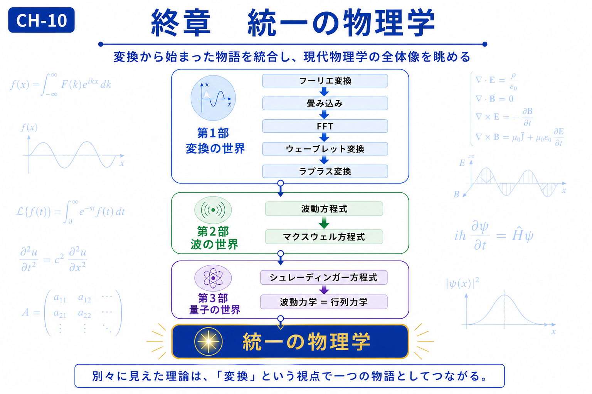

# Final Chapter — Unified Physics

# 終章　統一の物理学

← [Back to Articles / 記事一覧へ戻る](README.md)

---

# English

## Overview

Throughout this textbook, we have explored physics from three complementary perspectives.

Part I introduced transformations as tools for changing mathematical representations.

Part II showed that many physical phenomena share common wave structures.

Part III demonstrated how these ideas naturally extend into quantum mechanics.

Although these topics are often taught separately, they are deeply connected. Transformations, waves, and quantum theory are not isolated subjects but different viewpoints for understanding the same physical world.

This final chapter reviews those connections and presents a unified conceptual map of the journey from Fourier Transform to modern physics.

## What You Will Learn

In this chapter, you will:

* Review the entire learning path.
* Understand how the three parts are connected.
* Recognize transformation as a unifying perspective.
* See how different mathematical descriptions reveal the same physical reality.

## Related Figures

* CH-10 — Chapter Header
* [SS-08 — Unified Concept Map](../figures/ss/ss-08.png)

---

# 日本語

## 概要

本教材では、物理学を三つの視点から学んできました。

第1部では、**変換**によって現象の見方を変える方法を学びました。

第2部では、**波**という共通構造を通して様々な自然現象を理解しました。

第3部では、それらの考え方が**量子力学**へどのようにつながるのかを見てきました。

一見すると別々に見えるこれらの理論は、それぞれ独立した知識ではありません。

「変換」「波」「量子」は互いに結び付き、一つの物理学として理解することができます。

本章では、フーリエ変換から始まった学習の流れを振り返り、本教材全体を一つの物語として整理します。

## この章で学ぶこと

本章では、

* 教材全体の学習の流れを振り返る
* 第1部・第2部・第3部のつながりを理解する
* 「変換」という視点が教材全体を貫いていることを理解する
* 異なる数学的表現が一つの物理を記述するという考え方を整理する

ことを目標とします。

## 関連図

* CH-10　章タイトル図
* [SS-08　教材全体統一図](../figures/ss/ss-08.png)

---

## Navigation

Previous →

[CH-09 Wave Mechanics = Matrix Mechanics / 第9章 波動力学＝行列力学](ch-09.md)

← [Back to Articles / 記事一覧へ戻る](README.md)
