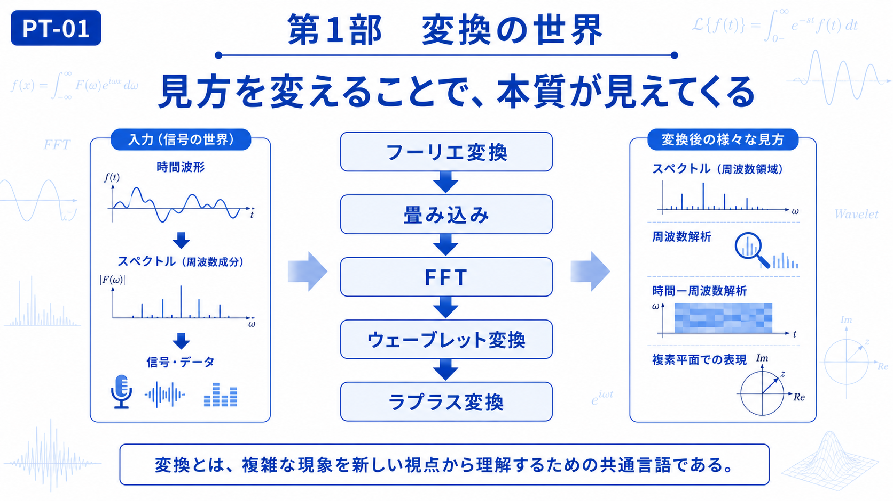

# Part I — Transformations

# 第1部　変換の世界

← [Back to Articles](README.md)

---

# English

## Overview

Transformation is one of the most powerful ideas in mathematics, engineering, and physics.

Rather than changing a physical phenomenon itself, a transformation changes **how we represent and observe it**. By choosing a more suitable representation, structures that are difficult to recognize in the original form often become much clearer.

This part introduces five representative transformations used throughout modern science. Beginning with the Fourier Transform, readers will learn how different transformations reveal different aspects of the same physical phenomenon.

The concepts developed here become the foundation for the study of wave theory in Part II and quantum mechanics in Part III.

## Chapters

* [CH-01 Fourier Transform](ch-01.md)
* [CH-02 Convolution](ch-02.md)
* [CH-03 FFT](ch-03.md)
* [CH-04 Wavelet Transform](ch-04.md)
* [CH-05 Laplace Transform](ch-05.md)

## Learning Objectives

After completing this part, you will be able to:

* Understand why transformations are useful.
* Recognize the strengths of different transformation methods.
* Prepare for wave theory and quantum mechanics through a common mathematical perspective.

---

# 日本語

## 概要

変換とは、物理現象そのものを変える技術ではなく、**現象の見方を変えるための考え方**です。

複雑に見える波形や信号も、適切な変換を行うことで、その背後にある構造や特徴をより理解しやすい形で表現できます。

本部では、フーリエ変換から始まり、畳み込み、FFT、ウェーブレット変換、ラプラス変換へと進みながら、それぞれの変換がどのような目的で利用され、どのような特徴を持つのかを学びます。

ここで身につける「変換」という視点は、第2部「波の世界」、そして第3部「量子の世界」を理解するための共通基盤となります。

## 収録章

* [CH-01 フーリエ変換](ch-01.md)
* [CH-02 畳み込み](ch-02.md)
* [CH-03 FFT](ch-03.md)
* [CH-04 ウェーブレット変換](ch-04.md)
* [CH-05 ラプラス変換](ch-05.md)

## 学習目標

この部を学ぶことで、

* 変換を用いる目的を理解する
* 各変換の役割と特徴を比較できる
* 波動・量子力学へつながる数学的な考え方を身につける

ことを目標とします。

---

## Next / 次へ

→ [CH-01 Fourier Transform / 第1章 フーリエ変換](ch-01.md)

← [Back to Articles / 記事一覧へ戻る](README.md)
