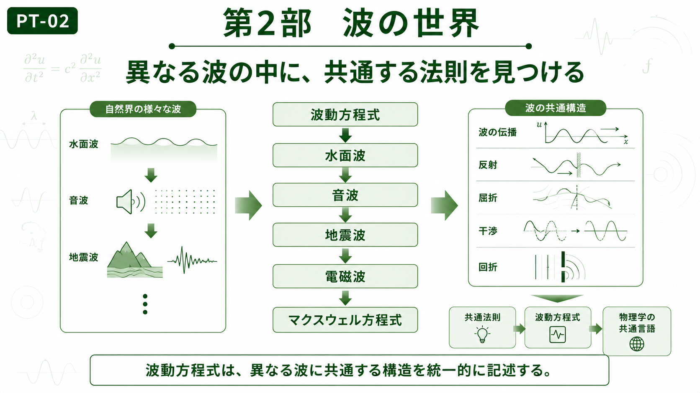

# Part II — Waves

# 第2部　波の世界

← [Back to Articles](README.md)

---

# English

## Overview

In Part I, we explored mathematical transformations that reveal hidden structures within signals and functions.

Part II shifts the focus from mathematical techniques to physical phenomena.

Although water waves, sound waves, electromagnetic waves, and seismic waves appear very different, they share common mathematical principles. By studying these shared structures, we can understand a wide variety of physical systems through a unified perspective.

This part introduces the wave equation as the fundamental description of wave propagation and then extends these ideas to Maxwell's equations, which explain the behavior of electromagnetic waves.

## Chapters

* [CH-06 Wave Equation](ch-06.md)
* [CH-07 Maxwell's Equations](ch-07.md)

## Learning Objectives

After completing this part, you will be able to:

* Recognize the common mathematical structure shared by different types of waves.
* Understand the role of the wave equation in physics.
* Explain how electromagnetic waves emerge from Maxwell's equations.
* Build the foundation for quantum mechanics in Part III.

---

# 日本語

## 概要

第1部では、現象を別の視点から理解するための**変換**について学びました。

第2部では、その考え方を実際の物理現象へ適用し、**波**という共通の視点から自然界を眺めます。

水面波、音波、地震波、電磁波は一見すると異なる現象ですが、それらは共通する数学的構造を持っています。

本部では、まず波動方程式によって様々な波を統一的に理解し、その後マクスウェル方程式を通して電磁波の性質を学びます。

これらの内容は、第3部で扱う量子力学へと自然につながっていきます。

## 収録章

* [CH-06 波動方程式](ch-06.md)
* [CH-07 マクスウェル方程式](ch-07.md)

## 学習目標

この部を学ぶことで、

* 様々な波に共通する構造を理解する
* 波動方程式の役割を説明できる
* マクスウェル方程式と電磁波の関係を理解する
* 量子力学につながる「波」の考え方を身につける

ことを目標とします。

---

## Next / 次へ

→ [CH-06 Wave Equation / 第6章 波動方程式](ch-06.md)

← [Back to Articles / 記事一覧へ戻る](README.md)
