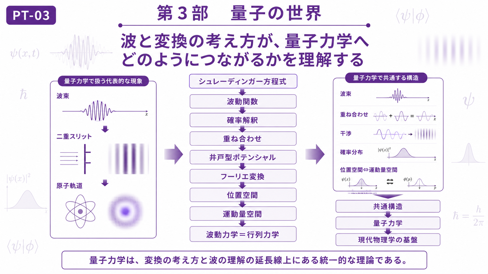

# Part III — Quantum Physics
# 第3部　量子の世界

← [Back to Articles](README.md)

---

# English

## Overview

Part III introduces quantum physics as an extension of the ideas developed in the previous parts.

In Part I, we studied transformation as a way of changing perspective. In Part II, we studied waves as a common structure appearing throughout physics. Quantum mechanics brings these two ideas together: physical states are described by wave functions, and transformations connect different representations of the same state.

This part focuses on the Schrödinger equation and the relationship between wave mechanics and matrix mechanics. The goal is not to cover all of quantum mechanics, but to understand how quantum theory can be viewed as a continuation of the themes of transformation and waves.

## Chapters

- [CH-08 Schrödinger Equation](ch-08.md)
- [CH-09 Wave Mechanics = Matrix Mechanics](ch-09.md)

## Learning Objectives

After completing this part, you will be able to:

- Understand quantum mechanics as an extension of wave theory.
- Recognize the role of wave functions in describing quantum states.
- Understand why different mathematical representations can describe the same physical system.
- Prepare for the final chapter, where transformation, waves, and quantum theory are integrated.

---

# 日本語

## 概要

第3部では、量子力学を**波と変換の延長**として理解します。

第1部では、現象の見方を変えるための「変換」を学びました。第2部では、自然界に現れる様々な波を共通構造として理解しました。量子力学では、この二つの考え方が結び付き、物理状態を波動関数として表し、さらに異なる表現の間を変換しながら同じ現象を記述します。

本部では、シュレーディンガー方程式と、波動力学＝行列力学の関係を扱います。目的は量子力学全体を網羅することではなく、量子論を「変換」と「波」という本教材の主題の延長として理解することです。

## 収録章

- [CH-08 シュレーディンガー方程式](ch-08.md)
- [CH-09 波動力学＝行列力学](ch-09.md)

## 学習目標

この部を学ぶことで、

- 量子力学を波の理論の延長として理解する
- 波動関数が量子状態を記述する意味を理解する
- 異なる数学的表現が同じ物理系を記述できることを理解する
- 終章「統一の物理学」への準備をする

ことを目標とします。

---

## Next / 次へ

→ [CH-08 Schrödinger Equation / 第8章 シュレーディンガー方程式](ch-08.md)

→ [Final Chapter — Unified Physics / 終章 統一の物理学](ch-10.md)

← [Back to Articles / 記事一覧へ戻る](README.md)
